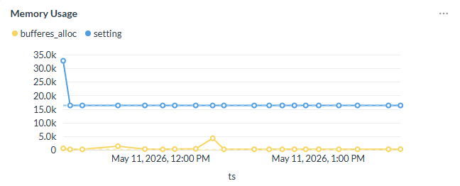

# epg_stat_history
Statistics repository and interval based performance metrics and reports with plpgsql.

# Description
EPG stat history collects the statistics from the Postgresql catalog and creates its own historical repository. Then simply select the statistical information within the supplied time period. 

With EPG stat history, you are able to ask questions like;
Whats is my IO for the last hour.
What was the performance bottleneck yesterday night between 23:00 and 03:00 hours. 
And so on... 

# Installation Prerequisities
## Configuring statistics collector
EPG stats is highly dependent to the Postgresql native statistics collector. So at least the following tracking options should be enabled.

You can configure the settings by editing the postgresql.conf file.

```
track_counts = on
track_io_timing = on
track_activities = on
track_functions = on
track_wal_io_timing = on
track_activity_query_size = 1024
```

Or, you can alter the system.

```
alter system set track_counts = on;
alter system set track_io_timing = on;
alter system set track_activities = on;
alter system set track_activity_query_size = 1024;
```

## Installing pg_stat_statements
EPG stats also collects the pg_stat_statements data (if the extension is installed). It is recommended if you install pg_stat_statements for more refined analysis of the database. 

[pg_stat_statements latest documentation](https://www.postgresql.org/docs/current/pgstatstatements.html)

```
create extension pg_stat_statements; 
select * from pg_extensions;
select * from pg_stat_statements; 
```

## Installing pg_cron
EPG_stats works on its own historical repository by periodically collecting Postgresql statistics in a timely manner. Collection is achieved by calling epg_stats.fill_meta() procedure for a predefined interval. Filling in the repository frequently consumes disk space but gives more granular investigation of the database performance metrics. By executing collection for long intervals, disk consumption may be lowered but the granularity will also be decreased. 

[pg_cron](https://github.com/citusdata/pg_cron) extension is a good option to schedule statistics collection in a timely manner. 

## Installing adminpack
In order to be able to create text file based reports adminpack extension should be installed. 

```
create extension adminpack;
```

> **_NOTE:_**
> Creating text file based reports are no longer supported. epg_stats.show_report() function can be used to print the report to SQL Terminal.
> Terminal output can be forwarded to a file if it is needed. 

# EPG_stats installation
1. Download the codes from this site. ([https://github.com/ergemp/EPG_stats/](https://github.com/ergemp/epg_stat_history))
2. Copy the files to your postgresql database.
3. Unzip the files and cd to the unzipped folder. 

4. You should get the following directory structure
```
d-----        30.04.2026     08:31                awr
d-----        11.05.2026     23:00                example
d-----        11.05.2026     13:55                getter
d-----         8.05.2026     09:58                install
d-----        12.05.2026     08:20                metabase
d-----        30.04.2026     08:31                metadata
d-----        30.04.2026     08:31                sample
d-----         4.05.2026     14:08                util
-a----        30.04.2026     08:31             11 .gitignore
-a----        30.04.2026     08:31           3682 README.md
```

5. Without changing the current directory execute install/install.sh <your_database_name>

This script will create a schema named epg_stats and install its own repository there. 
Do not forget to supply the name of your database. EPG_stats ONLY works on the database it is installed in. 

## Patching EPG_stats with a new version
After downloading and uncompressing the EPG_stats from the github page, instead of installing from scratch you can just install the functions and keep you collected repository. To do this, run install/patch.sh instead of the installer. 

```
install/patch.sh <your_database_name>
```
# Functions 

There are two main functions to get metrics from the repository (of course you can always select and find your path on the raw tables). 

## get_stat ... functions

get_stat... functions gives you the difference metrics between the interval indicated with a parameter starting from the epoch timestamp given as a parameter. This type of query gives you the metrics between the specified time interval.

```
select
	to_timestamp(begin_ts),
	to_timestamp(end_ts),
	xact_commit
from
	epg_stats.get_stat_database_hist(cast(extract(epoch from now()) as bigint),
	'1 Day'::interval)
where
	datname = 'postgres';
/*
2026-05-11 11:22:54.000 +0300	2026-05-11 13:36:55.000 +0300	1561
*/
```

## get_series ... functions

get_series... type of functions gives you metrics within each snapshot of the given interval. By using "series" you can use the historical data to monitor you metrics on a historical manner which enables you to identify anomalies on a sliding timeseries. 

```
select
	to_timestamp(begin_ts),
	to_timestamp(end_ts),
	xact_commit
from
	epg_stats.get_series_database_hist(cast(extract(epoch from now()) as bigint),
	'1 Day'::interval)
where
	datname = 'postgres';
/*
2026-05-11 13:31:20.000 +0300	2026-05-11 13:36:55.000 +0300	57
2026-05-11 13:26:45.000 +0300	2026-05-11 13:31:20.000 +0300	81
2026-05-11 13:14:57.000 +0300	2026-05-11 13:26:45.000 +0300	166
2026-05-11 13:07:51.000 +0300	2026-05-11 13:14:57.000 +0300	80
2026-05-11 13:00:12.000 +0300	2026-05-11 13:07:51.000 +0300	88
2026-05-11 12:55:15.000 +0300	2026-05-11 13:00:12.000 +0300	32
2026-05-11 12:50:56.000 +0300	2026-05-11 12:55:15.000 +0300	64
2026-05-11 12:46:19.000 +0300	2026-05-11 12:50:56.000 +0300	107
2026-05-11 12:41:20.000 +0300	2026-05-11 12:46:19.000 +0300	32
2026-05-11 12:35:38.000 +0300	2026-05-11 12:41:20.000 +0300	39
2026-05-11 12:24:06.000 +0300	2026-05-11 12:35:38.000 +0300	47
2026-05-11 12:19:49.000 +0300	2026-05-11 12:24:06.000 +0300	69
2026-05-11 12:13:22.000 +0300	2026-05-11 12:19:49.000 +0300	99
2026-05-11 12:05:23.000 +0300	2026-05-11 12:13:22.000 +0300	93
2026-05-11 12:00:48.000 +0300	2026-05-11 12:05:23.000 +0300	87
2026-05-11 11:54:01.000 +0300	2026-05-11 12:00:48.000 +0300	66
2026-05-11 11:43:45.000 +0300	2026-05-11 11:54:01.000 +0300	185
2026-05-11 11:30:11.000 +0300	2026-05-11 11:43:45.000 +0300	54
2026-05-11 11:25:33.000 +0300	2026-05-11 11:30:11.000 +0300	76
2026-05-11 11:22:54.000 +0300	2026-05-11 11:25:33.000 +0300	39
2026-05-11 11:22:54.000 +0300	2026-05-11 11:22:54.000 +0300	0
*/
```
### Sample chart for a series data



# Examples 

## Filling up the repo
In order to start filling up the repository run the ```call epg_stats.fill_meta();``` command. The more frequently you run, more granular information you can get, but this also means more data to gather and ends up space consumption. Every 30 minutes for filling the repository is enough for most of the cases. 

## Gathering the performance report
To generate a report run the epg_stats.show_report procedure with the required parameters. 

The following command will generate an overview report of the postgresql database for the last one day. 

```
call epg_stats.show_report (cast(extract (epoch from now()) as bigint), INTERVAL '1 days');
```

Sample report can be found in the "sample" directory. 


