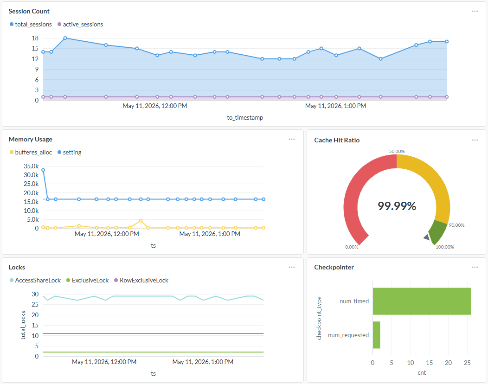
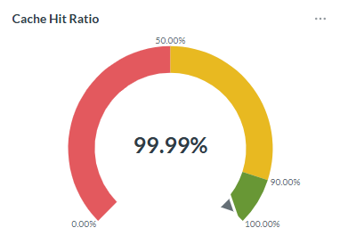
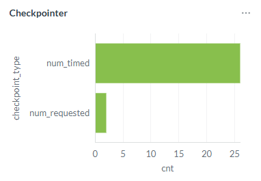
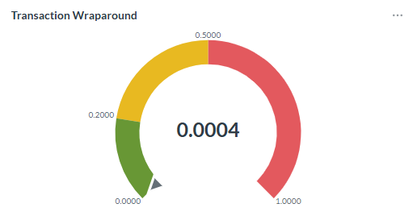

# Metabase

[Metabase](https://www.metabase.com/) is a visualization solution which can draw various kind of charts on you SQL queries. Since this project only consists of SQL and PLPGSQL commands and historical tables, metabase is a viable solution to visualize our data.

# Sample Dashboard 



# Sample Reports and SQL

## Session Count 

```
select
	case
		when state = 'active' then count(1)
	end as active_sessions,
	count(1) as total_sessions,
	to_timestamp(ts)
from
	epg_stats.get_stat_activity_hist (cast(extract(epoch from now()) as bigint),
	'1 days'::interval)
group by
	ts,
	state
order by
	ts desc;
```


## Memory Usage

```
select
	to_timestamp(bgh.begin_ts) as ts,
	((cast(bgh.buffers_alloc as bigint) * 8192)/ 1024) as bufferes_alloc,
	(cast(psh.setting as bigint)) as setting
from
	epg_stats.get_series_bgwriter_hist(cast(extract(epoch from now()) as bigint),
	'1 days'::interval) bgh
left join 
(
	select
		ts,
		cast(setting as bigint) as setting
	from
		epg_stats.get_series_settings_hist(cast(extract(epoch from now()) as bigint),
		'1 days'::interval)
	where
		name = 'shared_buffers'
) psh
on
	(psh.ts = bgh.begin_ts);
```


## Cache Hit Ratio

```
select
	round(cast(blks_hit as decimal) / cast((blks_hit + blks_read) as decimal), 4) as hit_ratio
from
	epg_stats.get_stat_database_hist(cast(extract(epoch from now()) as bigint),
	'1 Day'::interval )
where
	datname = 'postgres';
```



## Locks

```
select
	to_timestamp(ts) as ts,
	mode, 
	granted, 
	count(*) as total_locks
from
	epg_stats.get_stat_locks_hist(cast(extract(epoch from now()) as bigint),
	'1 Day'::interval)
group by
	mode,
	granted,
	ts
order by
	ts,
	mode,
	granted;
```


## Checkpointer

```
select
	'num_timed' as checkpoint_type,
	num_timed as cnt
from
	epg_stats.get_stat_checkpointer_hist(cast(extract(epoch from now()) as bigint),
	'1 Day'::interval)
union all
select
	'num_requested' as checkpoint_type,
	num_requested as cnt
from
	epg_stats.get_stat_checkpointer_hist(cast(extract(epoch from now()) as bigint),
	'1 Day'::interval);
```




## Transaction Wraparound

```
select
	max(round(100 *(age(datfrozenxid)/ setting::numeric), 8))
from
	pg_database d
cross join pg_settings s
where
	s.name = 'autovacuum_freeze_max_age';
```


