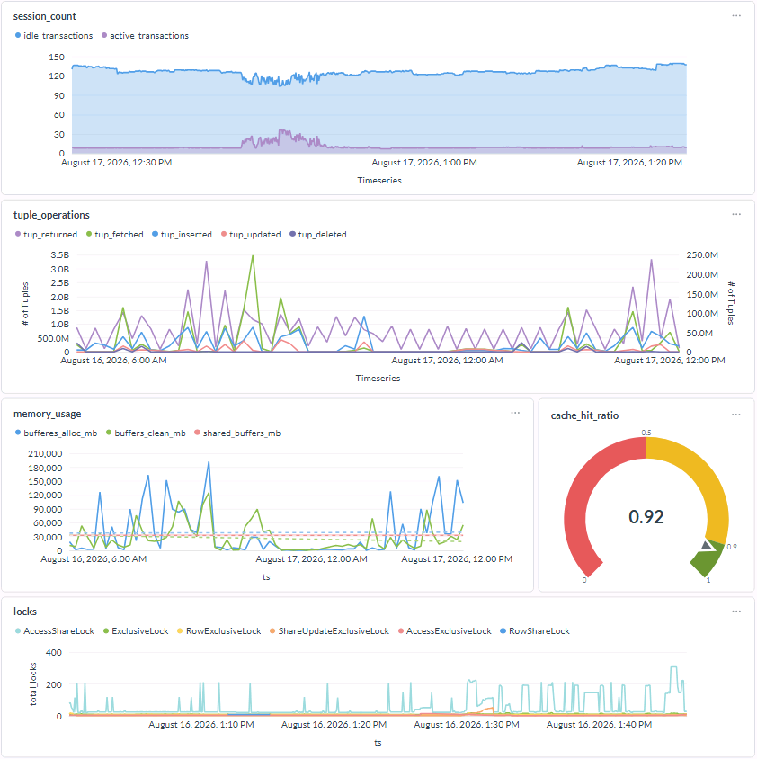
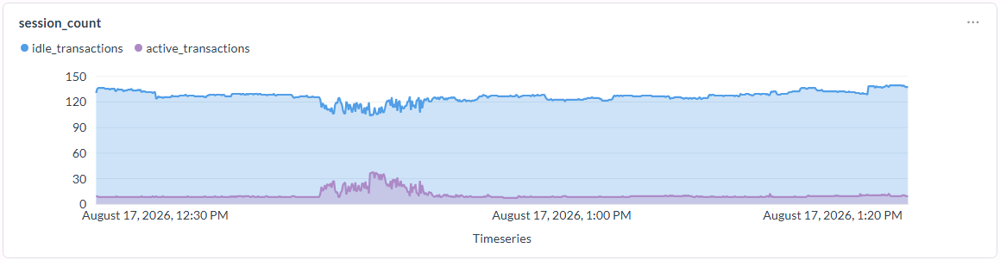
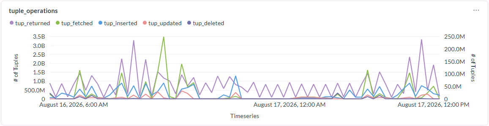
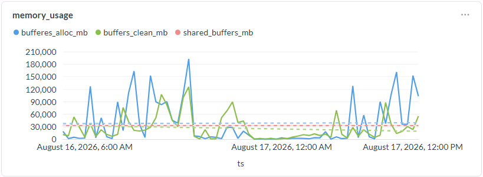
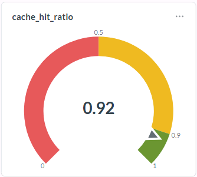
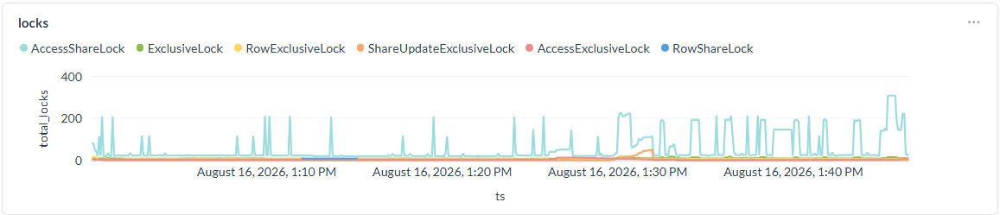
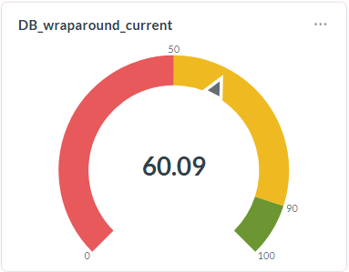
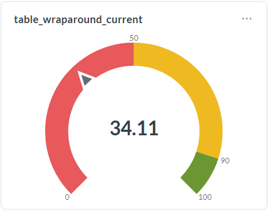
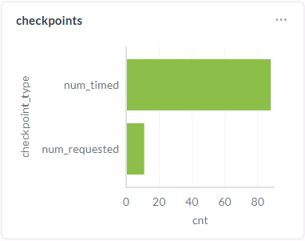

# Metabase

[Metabase](https://www.metabase.com/) is a visualization solution which can draw various kind of charts on you SQL queries. Since this project only consists of SQL and PLPGSQL commands and historical tables, metabase is a viable solution to visualize our data.

# Sample Dashboard 



# Sample Reports and SQL

## Session Count 

```
select 
	 sum(idle_transactions) as idle_transactions,
	 sum(active_transactions) as active_transactions,
	 to_timestamp(ts)
	 from
	 (
		select 
	    case when state='idle' then count(1) end as idle_transactions,
	    case when state!='idle' then count(1) end as active_transactions,
		max(ts) as ts
		from 
			epg_stats.stat_activity_hist 
		where 
			ts >= cast(extract(epoch from clock_timestamp()-'1 hour'::interval) as bigint)
			and usename is not null --ignore internal activities
			and state is not null --ignore LogicalLauncherMain
		group by 
			ts,
			state
	 ) t
	 group by ts
	 order by ts desc
```



## Tuple Operations

```
SELECT
  to_timestamp(begin_ts),
  tup_returned,
  tup_fetched,
  tup_inserted,
  tup_updated,
  tup_deleted
FROM
  epg_stats.get_series_database_hist (
    cast(
      extract(
        epoch
        FROM
          clock_timestamp()
      ) AS bigint
    ),
    interval '24 hour'
  )
WHERE
  datname = 'postgres'
ORDER BY
  begin_ts DESC;
```



## Memory Usage

```
select
	to_timestamp(bgh.begin_ts) as ts,
	(cast(bgh.buffers_alloc as bigint) * 8192)/1024/1024 as bufferes_alloc_mb,
	(cast(buffers_checkpoint+buffers_clean+buffers_backend as bigint) * 8192)/1024/1024 as buffers_clean_mb,
	(cast(psh.setting as bigint) * 8192)/1024/1024 as shared_buffers_mb
from
	epg_stats.get_series_bgwriter_hist(cast(extract(epoch from now()) as bigint),
	'1 days'::interval) bgh
left join 
(
	select
		ts,
		cast(setting as bigint) as setting
	from
		epg_stats.get_series_settings_hist(cast(extract(epoch from now()) as bigint),
		'1 days'::interval)
	where
		name = 'shared_buffers'
) psh
on
	(psh.ts = bgh.begin_ts)
order by ts desc
```



## Cache Hit Ratio

```
select
	round(cast(blks_hit as decimal) / cast((blks_hit + blks_read) as decimal), 4) as hit_ratio
from
	epg_stats.get_stat_database_hist(cast(extract(epoch from now()) as bigint),
	'1 Day'::interval )
where
	datname = 'postgres';
```



## Locks

```
select
	to_timestamp(ts) as ts,
	mode, 
	granted, 
	count(*) as total_locks
from
	epg_stats.get_stat_locks_hist(cast(extract(epoch from now()) as bigint),
	'1 Day'::interval)
group by
	mode,
	granted,
	ts
order by
	ts,
	mode,
	granted
```



## DB wraparound

```
select
	max(round(100 *(age(datfrozenxid)/ setting::numeric), 8)) as db_wraparound
from
	pg_database d
cross join pg_settings s
where
	s.name = 'autovacuum_freeze_max_age';
```



## Table wraparound

```
select
	round(100 * (max(age(relfrozenxid)) / s.setting::numeric), 8) as table_wraparound
from
	pg_class
cross join pg_settings s
where
	s.name = 'autovacuum_freeze_max_age'
	and
	pg_class.relkind in ('r', 't')
group by
	s.setting
```



## Checkpointer

```
--pg15
select
	'num_timed' as checkpoint_type,
	num_timed as cnt
from
	epg_stats.get_stat_checkpointer_hist(cast(extract(epoch from now()) as bigint),
	'1 Day'::interval)
union all
select
	'num_requested' as checkpoint_type,
	num_requested as cnt
from
	epg_stats.get_stat_checkpointer_hist(cast(extract(epoch from now()) as bigint),
	'1 Day'::interval);
```

```
--pg14
select
	'num_timed' as checkpoint_type,
	checkpoints_timed as cnt
from
	epg_stats.get_stat_bgwriter_hist(cast(extract(epoch from now()) as bigint),
	'1 Day'::interval)
union all
select
	'num_requested' as checkpoint_type,
	checkpoints_req as cnt
from
	epg_stats.get_stat_bgwriter_hist(cast(extract(epoch from now()) as bigint),
	'1 Day'::interval);
```



## Top Wait Events

```
select
	date_trunc('hour', to_timestamp(ts)),
	wait_event_type,
	wait_event,
	count(*) wait_count
from
	epg_stats.get_stat_activity_hist(cast(extract(epoch from clock_timestamp()) as bigint), interval '30 min' )
where
	state != 'idle'
	--and usename is not null
	and wait_event is not null
group by
	date_trunc('hour', to_timestamp(ts)),
	wait_event_type,
	wait_event
order by
	1 desc,
	4 desc
```


## Top Bloated Tables
```
select
	schemaname,
	relname,
    n_dead_tup,
    n_live_tup,
    1-round(n_live_tup/cast(n_live_tup+n_dead_tup as numeric),2) as bloat_ratio,
    last_autovacuum,
    last_vacuum
from
	epg_stats.get_stat_all_tables_hist(cast(extract(epoch from now()) as bigint),
	interval '30 min')
where
	schemaname not in ('pg_catalog', 'information_schema') and
	n_live_tup+n_dead_tup > 0
order by 5 desc
limit 10
```


## Top Queries
```
-- top executed queries
select 
	calls,
	total_time,
	blk_read_time,
	queryid,
	query
from 
	epg_stats.get_stat_statements_hist(cast(extract( epoch from now()) as bigint), '8 hour'::interval)
order by begin_ts desc, calls desc
limit 10;
	  
-- top time consuming queries
select 
	calls,
	total_time,
	blk_read_time,
	queryid,
	query
from 
	epg_stats.get_stat_statements_hist(cast(extract( epoch from now()) as bigint), '8 hour'::interval)
order by begin_ts desc, total_time desc
limit 10;
```